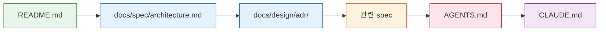

# Contributing to LuaGate

사람 기여자를 위한 온보딩 가이드.

> AI 도구 가이드: [AGENTS.md](AGENTS.md) (코딩 컨벤션, 불변식) / [CLAUDE.md](CLAUDE.md) (Claude Code 워크플로우)

---

## 읽기 순서



| 순서 | 문서 | 설명 |
|------|------|------|
| 1 | `README.md` | 프로젝트 개요, 빠른 시작 |
| 2 | `docs/spec/architecture.md` | 전체 아키텍처, 파이프라인 다이어그램 |
| 3 | `docs/design/adr/` | 설계 결정 배경 (ADR-001 ~ ADR-004) |
| 4 | 관련 spec (작업 영역별) | HTTP, Stream, Policy, Admin API 등 |
| 5 | `AGENTS.md` | 코딩 컨벤션, 불변식, 용어집 |
| 6 | `CLAUDE.md` | AI 개발 워크플로우 (참고용) |

---

## 첫 기여 가이드

LuaGate에 처음 기여한다면 다음과 같은 작은 작업부터 시작하는 것을 권장한다.

**시작하기 좋은 작업:**

- GitHub Issues에서 `good first issue` 라벨이 붙은 이슈 확인
- 문서 오타 수정, 설명 보강
- 테스트 케이스 추가 (기존 모듈의 edge case 커버리지 확대)
- 코드 주석 개선, 예제 추가
- luacheck/stylua 경고 해소

**기여 흐름 요약:**

1. 저장소를 fork하고 로컬에 clone한다.
2. 아래 "시작하기" 섹션을 따라 개발 환경을 설정한다.
3. 이슈 브랜치를 생성하고 변경 사항을 구현한다.
4. `make test-unit`으로 테스트를 확인한 뒤 PR을 생성한다.

> 질문이 있다면 GitHub Issues에 `question` 라벨로 이슈를 생성해 주세요.

---

## Architecture 개요

상세 스펙: [`docs/spec/architecture.md`](docs/spec/architecture.md), ADR-001 ~ ADR-004

### Shared Dict (ngx.shared.DICT)

OpenResty의 공유 메모리 영역으로, 모든 worker 프로세스가 접근하는 유일한 공유 저장소이다.
정책 blob(`luagate_policy`), 메트릭 카운터(`luagate_metrics`), 활성 연결 수(`luagate_connections`) 등을 관리한다.
zone 이름은 반드시 `luagate_` prefix를 사용한다.

### Policy Engine (정책 엔진)

YAML로 정의된 정책을 로드하여 요청별로 allow/deny를 판정하는 핵심 모듈이다.
정책 캐시는 module-level upvalue로 관리하며(`ngx.ctx` 사용 금지), shared dict의 버전 포인터 비교로 hot reload를 감지한다.
평가 방식은 first-match-wins이며, 매칭 실패 시 `default_action`을 적용한다.

### Rust FFI

URL 디코딩/정규화(decoder)와 보안 스캐닝(scanner) 등 성능 민감 로직을 Rust cdylib로 구현한다.
각 worker에서 `ffi.load()`로 .so를 로드하며, 호출은 동기·동일 worker 내에서만 수행한다.
FFI 함수가 할당한 메모리는 반드시 대응하는 free 함수를 호출하여 해제해야 한다.

---

## 시작하기

### 사전 요건

| 방법 | 필요 도구 |
|------|----------|
| **권장 (Nix)** | [Nix](https://nixos.org/download) + [direnv](https://direnv.net/) |
| 수동 | OpenResty 1.25+, LuaJIT 2.1, Rust 1.75+, Node.js 20+ |

### 개발 환경 설정

```bash
# 1. 클론
git clone https://github.com/dongwonkwak/luagate.git
cd luagate

# 2. Nix 개발 셸 진입 (모든 의존성 자동 설치)
nix develop
# 또는 direnv 사용 시: direnv allow

# 3. Git hooks 설치 (필수)
make install-hooks

# 4. FFI 빌드
make build

# 5. 테스트 실행
make test-unit

# HTTP 통합 테스트
# 로컬 Test::Nginx가 없으면 Docker Compose로 자동 fallback
make test-integration-http

# 전체 테스트
make test
```

### 로컬 실행

```bash
make up                              # Docker Compose 기동
curl http://localhost:9090/health    # Health check (Admin API 포트)
curl http://localhost:8080/          # 게이트웨이 동작 확인
make down                            # 종료
```

---

## 브랜치 전략

| 패턴 | 용도 |
|------|------|
| `main` | 항상 빌드 가능한 stable 상태 |
| `epic/NN-<name>` | Epic 단위 작업 |
| `dongwonkwak/don-NN-<slug>` | 개별 이슈 작업 |
| `hotfix/<description>` | 긴급 수정 |

- 이슈 브랜치는 Linear의 `gitBranchName` 패턴을 사용한다.
- main에 직접 push 금지. PR 필수.

---

## 커밋 메시지 형식

```
type(scope): 설명 [DON-XX]
```

| type | 설명 |
|------|------|
| `feat` | 새 기능 |
| `fix` | 버그 수정 |
| `docs` | 문서만 변경 |
| `test` | 테스트 추가/수정 |
| `refactor` | 리팩터링 |
| `chore` | 빌드/의존성/기타 |
| `perf` | 성능 개선 |

예:
```
feat(policy): implement first-match-wins evaluation [DON-42]
fix(scanner): handle NULL body in luagate_scan_http [DON-55]
docs(spec): update http-pipeline stream preread section [DON-90]
```

> `commitlint`이 **commit-msg hook**으로 형식을 자동 검사한다. (`make install-hooks` 후 적용)

---

## PR 규칙

1. **제목**: 커밋 메시지와 동일한 형식 `type(scope): 설명 [DON-XX]`
2. **본문**: `.github/pull_request_template.md` 자동 적용
3. **머지 전략**: Squash merge (epic → main)
4. **필수 조건**: CI 통과 (lint + unit test) + 최소 1개 승인

---

## 코딩 컨벤션 핵심

전체: [`.claude/knowledge/conventions.md`](.claude/knowledge/conventions.md)

- **Lua**: StyLua + luacheck. blocking I/O 핸들러 금지.
- **Rust**: `cargo fmt` + `cargo clippy --deny warnings`
- **FFI 함수명**: `luagate_<module>_<action>`
- **shared dict zone명**: `luagate_` prefix 필수
- **정책 캐시**: `ngx.ctx`에 저장 금지 — module-level upvalue 사용
- **Git hooks**: `make install-hooks` 후 적용
  - pre-commit: `stylua`, `luacheck`, `clang-format`, `shellcheck`, `markdownlint`, `prettier` (ui/, mcp/), `eslint` (ui/)
  - commit-msg: `commitlint`
  - pre-push: `test-unit`, `luacheck`, `vitest` (ui/), `tsc` (ui/, mcp/), `cargo test` (src/), `cargo clippy` (src/)

---

## 테스트 규칙

실행 메모:

- Nix dev shell에서는 `make test-unit`이 바로 동작한다.
- `make test-integration-http`는 로컬 `Test::Nginx::Socket`이 없으면 Docker Compose로 자동 fallback 한다.
- HTTP 통합 테스트만 고정 실행하려면 `make test-docker`를 사용한다.

| 변경 유형 | 필수 테스트 |
|----------|-----------|
| 정책 평가 로직 | `make test-unit-lua` |
| FFI 모듈 | `make test-unit-rust` + `make test-unit-lua` |
| HTTP 파이프라인 | `make test-integration-http` |
| Stream 파이프라인 | `make test-integration-stream` |
| Hot Reload | `make test-reload` |
| 전체 | `make test` |

새 기능 = 새 테스트 필수.

---

## 문서 업데이트 규칙

- **same-PR 규칙**: 코드 변경과 관련 스펙 문서 변경은 같은 PR에 포함.
- 변경 유형별 업데이트 대상: [`docs/spec/doc-strategy.md`](docs/spec/doc-strategy.md) §4 참조.

---

## 리뷰 프로세스

1. CI 자동 실행 (lint + test)
2. 보안/설계 변경 시: 코드 리뷰 요청 (Linear 이슈에 명시)
3. 최소 1개 승인 후 머지

---

## 이슈 작업 절차

1. Linear 이슈 상태 → **In Progress**
2. 브랜치 생성 (`gitBranchName` 패턴)
3. 구현 + 테스트 + 문서
4. 커밋: `type(scope): 설명 [DON-XX]`
5. PR 생성 → CI 통과 → 리뷰 → 머지
6. Linear 이슈 → **Done** + 완료 코멘트 (파일 경로 포함)
7. PR body에 `<!-- PROGRESS -->` 블록 포함 (머지 시 자동 갱신)

### 이슈 완료 기준

- [ ] 코드 구현 완료
- [ ] 테스트 추가/통과
- [ ] 관련 스펙 준수 (AGENTS.md 불변식)
- [ ] 문서 갱신 (same-PR)
- [ ] Linear 코멘트: 구현 파일 경로 포인터 포함
- [ ] PR body에 `<!-- PROGRESS -->` 블록 포함

---

## FAQ

### pre-commit hook이 실패합니다

`make install-hooks`를 실행했는지 확인한다. Nix dev shell 밖에서는 `stylua`, `luacheck` 등의 도구가 PATH에 없을 수 있다.

```bash
# Nix 환경 진입 후 다시 시도
nix develop
make install-hooks
git commit ...
```

`stylua` 포맷 오류라면 `stylua --check lua/`로 문제 파일을 확인하고, `stylua lua/`로 자동 수정할 수 있다.

### Docker 포트 충돌 (8080 또는 9090)

LuaGate는 기본적으로 8080(데이터 플레인)과 9090(Admin API)을 사용한다. 다른 프로세스가 해당 포트를 점유하고 있다면 `make up`이 실패한다.

```bash
# 포트 사용 중인 프로세스 확인
sudo lsof -i :8080
sudo lsof -i :9090

# 충돌 프로세스 종료 후 다시 실행
make down && make up
```

### `make build`에서 Rust 컴파일 오류

Rust 1.75 이상이 필요하다. Nix dev shell을 사용하면 올바른 toolchain이 자동으로 설정된다.

```bash
rustc --version   # 1.75 이상인지 확인
nix develop       # Nix 환경에서 자동 해결
make build
```

### 테스트가 `shared dict` 관련 오류를 발생시킵니다

단위 테스트는 `ngx.shared` mock을 사용한다. 테스트 파일 상단에 mock 설정이 누락되었는지 확인한다.
통합 테스트(`make test-integration-http`)는 실제 OpenResty 환경이 필요하며, 로컬에 `Test::Nginx`가 없으면 Docker Compose로 자동 fallback한다.

### `commitlint`이 커밋 메시지를 거부합니다

커밋 메시지가 Conventional Commits 형식을 따르는지 확인한다. 올바른 형식:

```
type(scope): 설명 [DON-XX]
```

예: `feat(policy): add rate limit rule [DON-99]`, `fix(scanner): handle empty body [DON-100]`

사용 가능한 type: `feat`, `fix`, `docs`, `test`, `refactor`, `chore`, `perf`

---

## 용어집

→ [AGENTS.md §용어집](AGENTS.md) 참조
