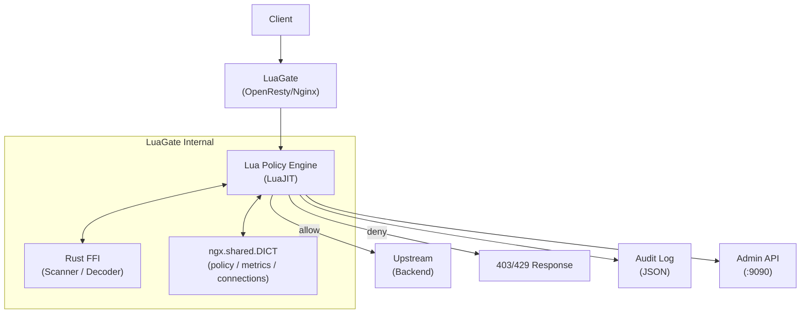

# LuaGate

> OpenResty(Nginx + LuaJIT) 기반 정책 구동 API/보안 게이트웨이

<!-- Badges (placeholder) -->
<!--  -->
<!--  -->
<!--  -->

<!-- Demo GIF placeholder -->
<!--  -->

---

## 주요 기능

| 기능 | 설명 | 상태 |
|------|------|------|
| 정책 기반 허용/차단 | YAML 정책 파일로 IP/경로/메서드 필터링 | Done |
| Hot Reload | 무중단 정책 갱신 (nginx reload 불필요) | Done |
| 위협 탐지 | Rust FFI 기반 스캐너 (SQLi, XSS 등) | Done |
| 감사 로그 | 구조화 JSON 로그 (결정 근거 포함) | Done |
| Admin API | REST API로 정책/상태 관리 (포트 9090) | Done |
| 스트림 프록시 | TCP/UDP 스트림 정책 적용 | Done |
| 메트릭 | Prometheus 형식 노출 (/metrics) | Done |
| Admin Dashboard | React 기반 관리 대시보드 (정책 편집, 메트릭 시각화) | Done |
| MCP 서버 | AI 어시스턴트용 Model Context Protocol 서버 | Done |

---

## Quick Start

### 사전 요건

| 방법 | 필요 도구 |
|------|----------|
| **권장 (Nix)** | [Nix](https://nixos.org/download) + [direnv](https://direnv.net/) |
| Docker (데모) | Docker 24+, Docker Compose v2 |
| 수동 | OpenResty 1.25+, LuaJIT 2.1, Rust 1.75+, Node.js 20+ |

### 1) 데모 실행 (Docker)

```bash
# 1. 클론
git clone https://github.com/dongwonkwak/luagate.git
cd luagate

# 2. 기동
make up

# 3. 검증
# Health check (Admin API 포트)
curl http://localhost:9090/health

# 게이트웨이 요청 (정책 평가)
curl http://localhost:8080/

# Admin API
curl http://localhost:9090/health
```

### 2) 개발 환경 (Nix)

```bash
git clone https://github.com/dongwonkwak/luagate.git
cd luagate

# Nix 개발 셸 진입 (모든 의존성 자동 설치)
nix develop
# 또는 direnv 사용 시: direnv allow

# 빌드
make build

# 전체 테스트
# HTTP 통합 테스트는 로컬 Test::Nginx가 없으면 Docker Compose로 자동 fallback
make test
```

### 테스트 실행 요약

```bash
# 단위 테스트
make test-unit

# HTTP 통합 테스트만
make test-integration-http

# HTTP 통합 테스트를 Docker Compose로 고정 실행
make test-docker
```

자세한 계약은 [docs/spec/test-strategy.md](docs/spec/test-strategy.md) 참조.

### 포트 표

| 포트 | 역할 |
|------|------|
| 8080 | HTTP data plane (게이트웨이) |
| 8443 | HTTPS data plane (TLS 종료, Phase 1 예정) |
| 9090 | Admin API + /metrics + /health |

---

## 아키텍처



**요청 흐름**: Client → Nginx TCP Accept → SSL/TLS → Lua access phase (정책 평가) → upstream proxy / deny

---

## 디렉토리 구조

```
luagate/
├── lua/            # Lua 핸들러 및 정책 엔진 모듈
├── src/            # Rust FFI 소스 (scanner, decoder, stream)
├── conf/           # nginx.conf 및 정책 YAML
├── docs/
│   ├── design/adr/ # 아키텍처 결정 기록 (ADR 001~011)
│   ├── spec/       # 스펙 문서 (10개)
│   └── runbook/    # 운영 대응 절차
├── tests/          # 단위(busted) + 통합(Test::Nginx) 테스트
├── e2e/            # Playwright E2E 테스트
├── scripts/        # 개발/운영 보조 스크립트
├── ui/             # Admin Dashboard UI (Vite + React + TypeScript)
├── mcp/            # MCP 서버 (Model Context Protocol)
├── benchmarks/     # 성능 측정 스크립트
├── policies/       # 정책 파일 예시
└── .claude/        # Claude Code 에이전트/스킬/메모리
```

---

## 기술 스택

| 레이어 | 기술 |
|--------|------|
| 런타임 | OpenResty 1.25 (Nginx + LuaJIT 2.1) |
| 정책 엔진 | Lua 5.1 (LuaJIT) |
| 위협 탐지 | Rust 1.75+ (cdylib FFI) |
| 설정 | YAML (정책), nginx.conf |
| 컨테이너 | Docker / Docker Compose |
| 개발 환경 | Nix flake + direnv |
| 테스트 | busted (단위), Test::Nginx (통합), Playwright (E2E), Vitest (UI 단위) |

---

## 문서

### 스펙

| 문서 | 내용 |
|------|------|
| [Architecture](docs/spec/architecture.md) | 프로세스 모델, 공유 상태 |
| [HTTP Pipeline](docs/spec/http-pipeline.md) | HTTP 요청 처리 파이프라인 |
| [Stream Pipeline](docs/spec/stream-pipeline.md) | TCP 스트림 처리 |
| [Policy Engine](docs/spec/policy-engine.md) | 정책 평가 규칙 |
| [Admin API](docs/spec/admin-api.md) | REST API 명세 |
| [Log Schema](docs/spec/log-schema.md) | 감사 로그 필드 |
| [Security Scanner](docs/spec/security-scanner.md) | FFI 스캐너 |
| [Rust FFI Modules](docs/spec/rust-ffi-modules.md) | Rust FFI ABI |
| [Test Strategy](docs/spec/test-strategy.md) | 테스트 전략 |
| [Doc Strategy](docs/spec/doc-strategy.md) | 문서화 전략 |

### ADR

> 전체 목록: [ADR 인덱스](docs/design/adr/README.md)

| 문서 | 결정 |
|------|------|
| [ADR-001](docs/design/adr/ADR-001-execution-shared-state-model.md) | 실행/상태 공유 모델 |
| [ADR-002](docs/design/adr/ADR-002-policy-evaluation-conflict-detection.md) | 정책 평가/충돌 탐지 |
| [ADR-003](docs/design/adr/ADR-003-policy-storage-hot-reload.md) | 정책 저장/Hot Reload |
| [ADR-004](docs/design/adr/ADR-004-log-metrics-admin-security.md) | 로그/메트릭/Admin/보안 |
| [ADR-005](docs/design/adr/ADR-005-policy-activation-concurrency.md) | 정책 활성화 모델 + 동시성 제어 |
| [ADR-006](docs/design/adr/ADR-006-metrics-cardinality-export-model.md) | 메트릭 Cardinality 제어 + Export 모델 |
| [ADR-007](docs/design/adr/ADR-007-log-redaction-and-retention.md) | 로그 Redaction 정책 + 보존/파기 기간 |
| [ADR-008](docs/design/adr/ADR-008-multi-instance-policy-sync.md) | 멀티 인스턴스 정책 동기화 |
| [ADR-009](docs/design/adr/ADR-009-ffi-timeout-enforcement.md) | FFI 타임아웃 강제 |
| [ADR-011](docs/design/adr/ADR-011-mcp-server.md) | MCP 서버 설계 |

### 개발 가이드

- [AGENTS.md](AGENTS.md) — 코딩 컨벤션, 불변식, 용어집
- [CLAUDE.md](CLAUDE.md) — Claude Code 개발 워크플로우
- [CONTRIBUTING.md](CONTRIBUTING.md) — 기여 가이드

---

## 벤치마크

> Phase 1 구현 완료 후 실측값 추가 예정

| 지표 | SLO (목표) | 실측 |
|------|-----------|------|
| p99 레이턴시 (정책 평가 포함) | < 5ms | Planned |
| 처리량 | > 10,000 req/s | Planned |
| 메모리 (worker당) | < 50MB | Planned |

---

## License

[MIT](LICENSE)
