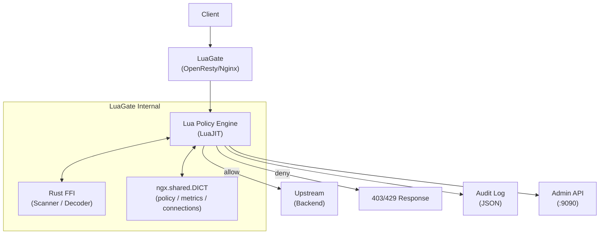

# LuaGate

> OpenResty(Nginx + LuaJIT) 기반 정책 구동 API/보안 게이트웨이
>
> Policy-driven API security gateway built on OpenResty (Nginx + LuaJIT) with Rust FFI threat detection


- YAML policy engine with hot reload (zero-downtime, no nginx reload)
- Rust FFI-based threat scanner (SQLi, XSS detection) with sub-millisecond overhead
- Structured JSON audit logging with decision tracing
- Admin Dashboard (React) + MCP server for AI-assisted policy management

<!-- Demo GIF placeholder -->
<!-- Generate with VHS: vhs docs/assets/demo.tape -->
<!-- Output: docs/assets/demo.gif -->
<!--  -->

---

## Quick Start

### Prerequisites

| Method | Requirements |
|--------|-------------|
| **Recommended (Nix)** | [Nix](https://nixos.org/download) + [direnv](https://direnv.net/) |
| Docker (demo) | Docker 24+, Docker Compose v2 |
| Manual | OpenResty 1.25+, LuaJIT 2.1, Rust 1.75+, Node.js 20+ |

### 1) Demo (Docker)

```bash
# 1. Clone
git clone https://github.com/dongwonkwak/luagate.git
cd luagate

# 2. Start
make up

# 3. Verify
# Health check (Admin API port)
curl http://localhost:9090/health

# Gateway request (policy evaluation)
curl http://localhost:8080/

# Admin API
curl http://localhost:9090/health
```

### 2) Development (Nix)

```bash
git clone https://github.com/dongwonkwak/luagate.git
cd luagate

# Enter Nix dev shell (all dependencies auto-installed)
nix develop
# Or with direnv: direnv allow

# Build
make build

# Full test suite
# HTTP integration tests auto-fallback to Docker Compose if local Test::Nginx is unavailable
make test
```

### Test Commands

```bash
# Unit tests
make test-unit

# HTTP integration tests only
make test-integration-http

# HTTP integration tests via Docker Compose
make test-docker
```

See [docs/spec/test-strategy.md](docs/spec/test-strategy.md) for details.

### Port Map

| Port | Role |
|------|------|
| 8080 | HTTP data plane (gateway) |
| 8443 | HTTPS data plane (TLS termination, Phase 1) |
| 9090 | Admin API + /metrics + /health |

---

## Features

| Feature | Description |
|---------|-------------|
| Policy-based allow/deny | YAML policy files for IP/path/method filtering |
| Hot Reload | Zero-downtime policy update (no nginx reload) |
| Threat Detection | Rust FFI scanner (SQLi, XSS, etc.) |
| Audit Log | Structured JSON logs with decision tracing |
| Admin API | REST API for policy/status management (port 9090) |
| Stream Proxy | TCP/UDP stream policy enforcement |
| Metrics | Prometheus-format export (/metrics) |
| Admin Dashboard | React-based management UI (policy editor, metrics visualization) |
| MCP Server | Model Context Protocol server for AI assistants |

---

## Architecture



**Request flow**: Client -> Nginx TCP Accept -> SSL/TLS -> Lua access phase (policy evaluation) -> upstream proxy / deny

---

## Directory Structure

```
luagate/
├── lua/            # Lua handlers and policy engine modules
├── src/            # Rust FFI source (scanner, decoder, stream)
├── conf/           # nginx.conf and policy YAML
├── docs/
│   ├── design/adr/ # Architecture Decision Records (14)
│   ├── runbook/    # Operations runbooks (6)
│   └── spec/       # Specification documents (10)
├── tests/          # Unit (busted) + integration (Test::Nginx) tests
├── e2e/            # Playwright E2E tests
├── scripts/        # Dev/ops helper scripts
├── ui/             # Admin Dashboard UI (Vite + React + TypeScript)
├── mcp/            # MCP server (Model Context Protocol)
├── benchmarks/     # Performance measurement scripts
├── policies/       # Example policy files
└── .claude/        # Claude Code agents/skills/memory
```

---

## Tech Stack

| Layer | Technology |
|-------|-----------|
| Runtime | OpenResty 1.25 (Nginx + LuaJIT 2.1) |
| Policy Engine | Lua 5.1 (LuaJIT) |
| Threat Detection | Rust 1.75+ (cdylib FFI) |
| Configuration | YAML (policies), nginx.conf |
| Container | Docker / Docker Compose |
| Dev Environment | Nix flake + direnv |
| Testing | busted (unit), Test::Nginx (integration), Playwright (E2E), Vitest (UI unit) |

---

## Benchmark

> Measured on Docker Compose (single instance), 12th Gen Intel Core i7-12700H, 20 cores.
> Full results: [docs/benchmark-results/baseline.md](docs/benchmark-results/baseline.md)

| Metric | SLO Target | Measured | Note |
|--------|-----------|----------|------|
| Policy eval RPS | > 10,000 req/s | **66,157 req/s** | wrk -t4 -c100 -d30s |
| Policy eval p99 latency | < 5ms | 11.22ms | Docker overhead + upstream 502 included |
| Gateway-only RPS | > 10,000 req/s | **338,831 req/s** | /health endpoint, no policy eval |
| Gateway-only p99 latency | < 5ms | **1.40ms** | Pure gateway path |

<!-- p99 SLO 초과 사유: Docker 네트워크 오버헤드 + Lua GC + upstream 502 응답 처리가 합산됨.
     게이트웨이 단독 경로(/health)는 p99=1.40ms로 목표 달성.
     베어메탈 환경에서는 p99 SLO 달성이 예상됨. -->

---

## Documentation

### Specs

| Document | Content |
|----------|---------|
| [Architecture](docs/spec/architecture.md) | Process model, shared state |
| [HTTP Pipeline](docs/spec/http-pipeline.md) | HTTP request processing pipeline |
| [Stream Pipeline](docs/spec/stream-pipeline.md) | TCP stream processing |
| [Policy Engine](docs/spec/policy-engine.md) | Policy evaluation rules |
| [Admin API](docs/spec/admin-api.md) | REST API specification |
| [Log Schema](docs/spec/log-schema.md) | Audit log fields |
| [Security Scanner](docs/spec/security-scanner.md) | FFI scanner |
| [Rust FFI Modules](docs/spec/rust-ffi-modules.md) | Rust FFI ABI |
| [Test Strategy](docs/spec/test-strategy.md) | Test strategy |
| [Doc Strategy](docs/spec/doc-strategy.md) | Documentation strategy |

### ADR

> Full list: [ADR Index](docs/design/adr/README.md)

| Document | Decision |
|----------|----------|
| [ADR-001](docs/design/adr/ADR-001-execution-shared-state-model.md) | Execution/shared state model |
| [ADR-002](docs/design/adr/ADR-002-policy-evaluation-conflict-detection.md) | Policy evaluation/conflict detection |
| [ADR-003](docs/design/adr/ADR-003-policy-storage-hot-reload.md) | Policy storage/Hot Reload |
| [ADR-004](docs/design/adr/ADR-004-log-metrics-admin-security.md) | Log/metrics/Admin/security |
| [ADR-005](docs/design/adr/ADR-005-policy-activation-concurrency.md) | Policy activation + concurrency control |
| [ADR-006](docs/design/adr/ADR-006-metrics-cardinality-export-model.md) | Metrics cardinality control + export model |
| [ADR-007](docs/design/adr/ADR-007-log-redaction-and-retention.md) | Log redaction policy + retention |
| [ADR-008](docs/design/adr/ADR-008-multi-instance-policy-sync.md) | Multi-instance policy sync |
| [ADR-009](docs/design/adr/ADR-009-ffi-timeout-enforcement.md) | FFI timeout enforcement |
| [ADR-010](docs/design/adr/ADR-010-opentelemetry-tracing.md) | OpenTelemetry tracing |
| [ADR-011](docs/design/adr/ADR-011-mcp-server.md) | MCP server design |
| [ADR-012](docs/design/adr/ADR-012-http-data-plane-rate-limiting.md) | HTTP Data Plane Rate Limiting |
| [ADR-014](docs/design/adr/ADR-014-scanner-pattern-hot-update.md) | Scanner Pattern Hot Update |
| [ADR-015](docs/design/adr/ADR-015-tls-termination.md) | TLS Termination |

### MCP Integration (AI Assistants)

LuaGate provides an [MCP (Model Context Protocol)](https://modelcontextprotocol.io/) server for managing policies via natural language through AI assistants.

```bash
# Set Admin API token in .env (required for make up)
echo 'LUAGATE_ADMIN_TOKEN=your-token-here-at-least-32-bytes-long' > .env

cd mcp && npm install && npm run build
```

Setup and integration test instructions: [mcp/README.md](mcp/README.md)

### Operations

- [Runbook Index](docs/runbook/README.md) -- Operations runbooks by scenario

### Development Guide

- [AGENTS.md](AGENTS.md) -- Coding conventions, invariants, glossary
- [CLAUDE.md](CLAUDE.md) -- Claude Code development workflow
- [CONTRIBUTING.md](CONTRIBUTING.md) -- Contribution guide

---

## License

[MIT](LICENSE)
