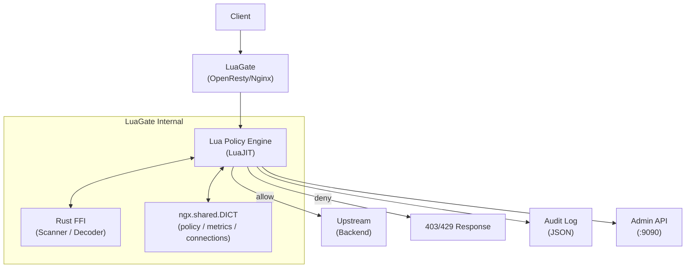

<div align="center">


**OpenResty(Nginx + LuaJIT) 기반 정책 구동 API/보안 게이트웨이**

[](https://github.com/dongwonkwak/luagate/actions/workflows/integration-test.yml)
[](https://github.com/dongwonkwak/luagate/actions/workflows/frontend-e2e.yml)
[](LICENSE)
[](https://openresty.org/)
[](src/)
[](docs/design/adr/README.md)

`66,000+ req/s` · `무중단 Hot Reload` · `Rust FFI 위협 탐지` · `React Admin Dashboard`

</div>

<!-- Demo GIF placeholder -->
<!--  -->

---

## 왜 LuaGate?

Nginx의 검증된 성능 위에 **Lua의 유연한 정책 엔진**과 **Rust의 안전한 위협 탐지**를 결합했습니다.
YAML 한 줄로 IP/경로/메서드를 필터링하고, 무중단 Hot Reload로 서비스 중단 없이 정책을 갱신합니다.
React 대시보드와 MCP 서버로 운영과 AI 자동화까지 지원합니다.

---

## :star2: 주요 기능

| | 기능 | 설명 |
|---|------|------|
| :shield: | 정책 기반 허용/차단 | YAML 정책 파일로 IP/경로/메서드 필터링 |
| :zap: | Hot Reload | 무중단 정책 갱신 (nginx reload 불필요) |
| :bug: | 위협 탐지 | Rust FFI 기반 스캐너 (SQLi, XSS 등) |
| :memo: | 감사 로그 | 구조화 JSON 로그 (결정 근거 포함) |
| :gear: | Admin API | REST API로 정책/상태 관리 (포트 9090) |
| :satellite: | 스트림 프록시 | TCP/UDP 스트림 정책 적용 |
| :bar_chart: | 메트릭 | Prometheus 형식 노출 (/metrics) |
| :computer: | Admin Dashboard | React 기반 관리 대시보드 (정책 편집, 메트릭 시각화) |
| :robot: | MCP 서버 | AI 어시스턴트용 Model Context Protocol 서버 |

---

## Quick Start

| 포트 | 역할 |
|------|------|
| 8080 | HTTP data plane (게이트웨이) |
| 8443 | HTTPS data plane (TLS 종료, Phase 1 예정) |
| 9090 | Admin API + /metrics + /health |

<details>
<summary><strong>Docker (데모)</strong></summary>

```bash
git clone https://github.com/dongwonkwak/luagate.git
cd luagate

# 기동
make up

# 검증
curl http://localhost:9090/health     # Health check
curl http://localhost:8080/           # 게이트웨이 요청 (정책 평가)
```

</details>

<details>
<summary><strong>Nix 개발 환경 (권장)</strong></summary>

```bash
git clone https://github.com/dongwonkwak/luagate.git
cd luagate

# Nix 개발 셸 진입 (모든 의존성 자동 설치)
nix develop
# 또는 direnv 사용 시: direnv allow

make build    # 빌드
make test     # 전체 테스트
```

테스트 명령어:

```bash
make test-unit               # 단위 테스트
make test-integration-http   # HTTP 통합 테스트
make test-docker             # Docker Compose 통합 테스트
```

자세한 전략은 [Test Strategy](docs/spec/test-strategy.md) 참조.

</details>

---

## 아키텍처



**요청 흐름**: Client → Nginx TCP Accept → SSL/TLS → Lua access phase (정책 평가) → upstream proxy / deny

> 상세: [Architecture Spec](docs/spec/architecture.md)

---

## 벤치마크

> 테스트 환경: Docker Compose (single instance), 12th Gen Intel i7-12700H, 20 cores
>
> 상세 결과: [docs/benchmark-results/baseline.md](docs/benchmark-results/baseline.md)

| 시나리오 | RPS | p50 | p99 |
|---------|-----|-----|-----|
| 게이트웨이 단독 (`/health`) | 338,831 | 0.23ms | 1.40ms |
| 정책 평가 (allow/deny) | 66,157 | 1.00ms | 11.22ms |
| Deny 평가 | 66,490 | 1.01ms | 10.94ms |

---

## 기술 스택

| 레이어 | 기술 |
|--------|------|
| 런타임 | OpenResty 1.25 (Nginx + LuaJIT 2.1) |
| 정책 엔진 | Lua 5.1 (LuaJIT) |
| 위협 탐지 | Rust 1.75+ (cdylib FFI) |
| UI | React 19 + TypeScript + Vite + Tailwind CSS |
| MCP | TypeScript + @modelcontextprotocol/sdk |
| 설정 | YAML (정책), nginx.conf |
| 컨테이너 | Docker / Docker Compose |
| 개발 환경 | Nix flake + direnv |
| 테스트 | busted (단위), Test::Nginx (통합), Playwright (E2E), Vitest (UI 단위) |

---

## 문서

- **스펙** (10개): [Architecture](docs/spec/architecture.md) · [HTTP Pipeline](docs/spec/http-pipeline.md) · [Stream Pipeline](docs/spec/stream-pipeline.md) · [Policy Engine](docs/spec/policy-engine.md) · [Admin API](docs/spec/admin-api.md) · [Log Schema](docs/spec/log-schema.md) · [Security Scanner](docs/spec/security-scanner.md) · [Rust FFI Modules](docs/spec/rust-ffi-modules.md) · [Test Strategy](docs/spec/test-strategy.md) · [Doc Strategy](docs/spec/doc-strategy.md)
- **ADR** (14개): [ADR 인덱스](docs/design/adr/README.md) — ADR-001~012, 014, 015
- **Runbook** (7개): [Runbook 인덱스](docs/runbook/README.md)
- **MCP 연동**: [mcp/README.md](mcp/README.md) — AI 어시스턴트용 MCP 서버 설정 및 사용법
- **개발 가이드**: [AGENTS.md](AGENTS.md) · [CONTRIBUTING.md](CONTRIBUTING.md)

---

## 디렉토리 구조

```
luagate/
├── lua/            # Lua 핸들러 및 정책 엔진 모듈
├── src/            # Rust FFI 소스 (scanner, decoder, stream)
├── conf/           # nginx.conf 및 정책 YAML
├── docs/
│   ├── design/adr/ # 아키텍처 결정 기록 (ADR 001~015)
│   └── spec/       # 스펙 문서 (10개)
├── tests/          # 단위(busted) + 통합(Test::Nginx) 테스트
├── e2e/            # Playwright E2E 테스트
├── scripts/        # 개발/운영 보조 스크립트
├── ui/             # Admin Dashboard UI (Vite + React + TypeScript)
├── mcp/            # MCP 서버 (Model Context Protocol)
├── benchmarks/     # 성능 측정 스크립트
├── policies/       # 정책 파일 예시
└── .claude/        # Claude Code 에이전트/스킬/메모리
```

---

## License

[MIT](LICENSE)
