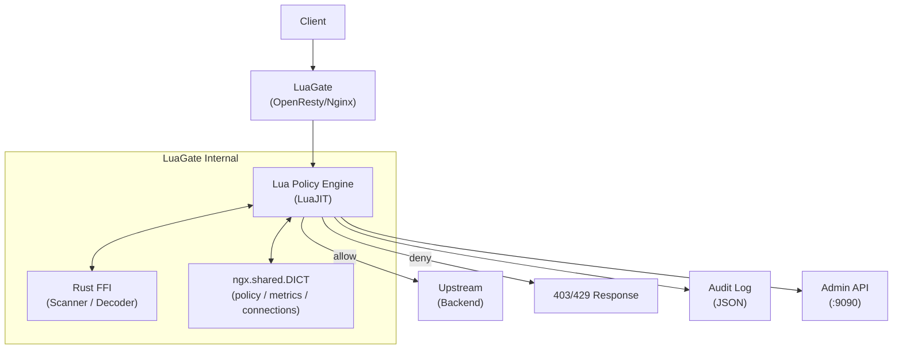

# LuaGate

> OpenResty(Nginx + LuaJIT) 기반 정책 구동 API/보안 게이트웨이

<!-- Badges (placeholder) -->
<!--  -->
<!--  -->
<!--  -->

<!-- Demo GIF placeholder -->
<!--  -->

---

## 주요 기능

| 기능 | 설명 | 상태 |
|------|------|------|
| 정책 기반 허용/차단 | YAML 정책 파일로 IP/경로/메서드 필터링 | 계획 |
| Hot Reload | 무중단 정책 갱신 (nginx reload 불필요) | 계획 |
| 위협 탐지 | Rust FFI 기반 스캐너 (SQLi, XSS 등) | 계획 |
| 감사 로그 | 구조화 JSON 로그 (결정 근거 포함) | 계획 |
| Admin API | REST API로 정책/상태 관리 (포트 9090) | 계획 |
| 스트림 프록시 | TCP/UDP 스트림 정책 적용 | 계획 |
| 메트릭 | Prometheus 형식 노출 | 계획 |

---

## Quick Start

### 사전 요건

- Docker + Docker Compose
- (개발) Nix + direnv (flake.nix 제공)

### 3단계 시작

```bash
# 1. 클론
git clone https://github.com/dongwonkwak/luagate.git
cd luagate

# 2. 기동
make up

# 3. 확인
curl http://localhost:8080/health       # HTTP 게이트웨이
curl https://localhost:8443/health      # HTTPS (자체 서명 인증서)
curl http://localhost:9090/api/v1/health # Admin API
```

### 포트 표

| 포트 | 용도 |
|------|------|
| 8080 | HTTP 게이트웨이 |
| 8443 | HTTPS 게이트웨이 |
| 9090 | Admin API |

---

## 아키텍처



**요청 흐름**: Client → Nginx TCP Accept → SSL/TLS → Lua access phase (정책 평가) → upstream proxy / deny

---

## 기술 스택

| 레이어 | 기술 |
|--------|------|
| 런타임 | OpenResty 1.25 (Nginx + LuaJIT 2.1) |
| 정책 엔진 | Lua 5.1 (LuaJIT) |
| 위협 탐지 | Rust 1.75+ (cdylib FFI) |
| 설정 | YAML (정책), nginx.conf |
| 컨테이너 | Docker / Docker Compose |
| 개발 환경 | Nix flake + direnv |
| 테스트 | busted (단위), Test::Nginx (통합) |

---

## 문서

### 스펙

| 문서 | 내용 |
|------|------|
| [Architecture](docs/spec/architecture.md) | 프로세스 모델, 공유 상태 |
| [HTTP Pipeline](docs/spec/http-pipeline.md) | HTTP 요청 처리 파이프라인 |
| [Stream Pipeline](docs/spec/stream-pipeline.md) | TCP 스트림 처리 |
| [Policy Engine](docs/spec/policy-engine.md) | 정책 평가 규칙 |
| [Admin API](docs/spec/admin-api.md) | REST API 명세 |
| [Log Schema](docs/spec/log-schema.md) | 감사 로그 필드 |
| [Security Scanner](docs/spec/security-scanner.md) | FFI 스캐너 |
| [C/FFI Modules](docs/spec/c-ffi-modules.md) | Rust FFI ABI |
| [Test Strategy](docs/spec/test-strategy.md) | 테스트 전략 |
| [Doc Strategy](docs/spec/doc-strategy.md) | 문서화 전략 |

### ADR

| 문서 | 결정 |
|------|------|
| [ADR-001](docs/design/adr/ADR-001-execution-shared-state-model.md) | 실행/상태 공유 모델 |
| [ADR-002](docs/design/adr/ADR-002-policy-evaluation-conflict-detection.md) | 정책 평가/충돌 탐지 |
| [ADR-003](docs/design/adr/ADR-003-policy-storage-hot-reload.md) | 정책 저장/Hot Reload |
| [ADR-004](docs/design/adr/ADR-004-log-metrics-admin-security.md) | 로그/메트릭/Admin/보안 |

### 개발 가이드

- [AGENTS.md](AGENTS.md) — 코딩 컨벤션, 불변식, 용어집
- [CLAUDE.md](CLAUDE.md) — Claude Code 개발 워크플로우
- [CONTRIBUTING.md](CONTRIBUTING.md) — 기여 가이드 *(작성 예정)*

---

## 벤치마크

*Phase 1 구현 완료 후 추가 예정*

<!-- Benchmark results placeholder -->

---

## License

[MIT](LICENSE)
