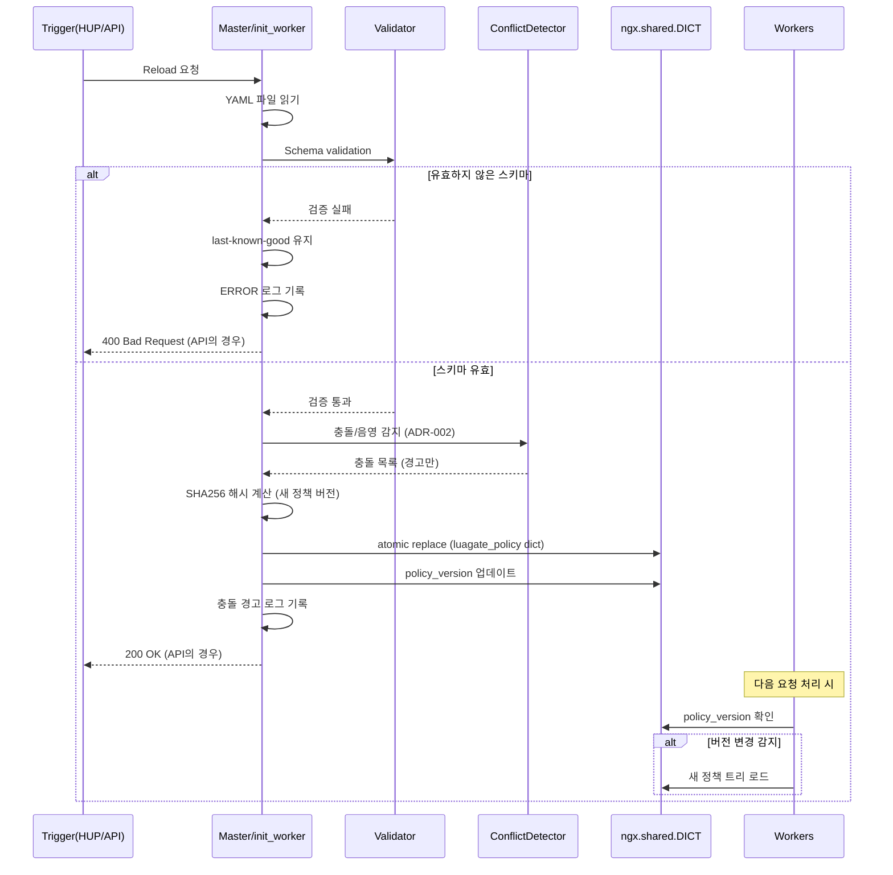

# ADR-003: 정책 저장소 + Hot Reload Semantics

| 항목 | 내용 |
|------|------|
| **Status** | Accepted |
| **Date** | 2026-03-13 |
| **Deciders** | LuaGate Architects |
| **Issue** | [DON-87](https://linear.app/dongwon/issue/DON-87) |
| **Depends on** | [ADR-002](./ADR-002-policy-evaluation-conflict-detection.md) |

---

## Status

**Accepted** — Phase 0-A에서 고정.

---

## Context

정책 규칙은 운영 중에 변경될 수 있다(보안 패턴 업데이트, IP 차단 추가 등).
변경 시 서비스 중단 없이 새 정책을 적용해야 한다.

해결해야 할 문제:

1. **정책 저장소**: 정책의 canonical source는 무엇인가?
2. **변경 API**: 어떤 인터페이스로 정책을 수정하는가?
3. **Reload 트리거**: 어떤 방식으로 새 정책을 로드하는가?
4. **원자성**: 일부 worker만 새 정책을 보는 상황을 방지하는가?
5. **실패 안전성**: 새 정책이 유효하지 않을 때 어떻게 처리하는가?
6. **버전 관리**: 어느 정책이 현재 활성인지 추적하는가?

---

## Decision

### §3.3 정책 저장소

**Canonical source: YAML 파일 (file-backed)**

- 정책의 단일 진실의 원천은 파일시스템의 YAML 파일이다.
- 기본 경로: `conf/policies.yaml` (Nginx config 디렉토리 기준)
- 런타임 상태(shared dict)는 이 파일로부터 파생된다.

**Admin API에 의한 수정:**

- Admin API(`PUT /api/v1/policies`)가 YAML 파일을 직접 수정한다.
- 쓰기는 **atomic write** 방식:
  1. 임시 파일(`policies.yaml.tmp`)에 새 내용 기록
  2. `rename()` 시스템 콜로 원자적 교체
  3. 실패 시 임시 파일 삭제, 원본 보존

### §3.3 Hot Reload 시맨틱스

**Reload 트리거 (두 가지):**

1. **HUP 시그널**: `kill -HUP <nginx_master_pid>`
2. **Admin API**: `POST /api/v1/policies/reload`

**Reload 과정 (순서 보장):**

**정책 버전 관리:**

- 버전 식별자: 정책 파일 전체 내용의 **SHA256 해시** (16진수 문자열)
- 저장 위치: `luagate_policy` shared dict의 `policy_version` 키
- 모든 요청 로그 및 메트릭에 현재 `policy_version` 포함
- 예: `policy_version: "a3f2c1d4e5b6..."`

**Worker 전파 메커니즘:**

각 worker는 요청 처리 시작 시(`access_by_lua_block` 진입 전):
1. `luagate_policy:get("policy_version")`으로 shared dict 버전 확인
2. 로컬 캐시 버전과 다르면 shared dict에서 새 정책 트리 로드
3. 로컬 버전 업데이트
4. 요청 처리 계속

이 방식으로 reload 완료 후 **모든 worker가 다음 요청 시** 새 정책을 사용한다.

**실패 안전성 (last-known-good):**

| 실패 시나리오 | 동작 |
|--------------|------|
| YAML 파싱 오류 | last-known-good 유지, ERROR 로그 |
| Schema 검증 실패 | last-known-good 유지, ERROR 로그 |
| 충돌 감지 | 로드 계속, WARN 로그 |
| shared dict 쓰기 실패 | last-known-good 유지, ERROR 로그 |

서버 최초 기동 시 정책 로드 실패 → 서버 시작 실패(fatal).

---

## Consequences

### 긍정적 결과

- **무중단 업데이트**: 정책 변경 시 Nginx worker 재시작 불필요
- **원자성**: SHA256 기반 버전 + shared dict atomic replace로 partial update 방지
- **실패 안전**: last-known-good 보장으로 잘못된 정책이 적용되지 않음
- **감사 추적**: 모든 로그/메트릭에 policy_version 포함

### 부정적 결과

- **전파 지연**: worker가 새 정책을 인식하는 시점이 "다음 요청 시"이므로,
  reload 직후 들어온 요청은 구 정책으로 처리될 수 있음 (수 ms 단위)
- **파일 시스템 의존**: YAML 파일이 canonical source이므로 디스크 장애 시 정책 복구 불가.
  정책 파일 백업 정책 필요
- **단일 파일 한계**: 정책 수가 매우 많아지면 단일 YAML 파일이 관리하기 어려워질 수 있음.
  멀티 파일 지원은 별도 ADR에서 결정

### 향후 고려

- 정책 변경 이력(git 기반) 관리 도구 연동 검토
- 대규모 정책(1000+ 규칙) 성능 측정 후 파싱 최적화 ADR 추가 가능

---

## 관련 문서

- [ADR-001](./ADR-001-execution-shared-state-model.md) — shared dict 구조
- [ADR-002](./ADR-002-policy-evaluation-conflict-detection.md) — 충돌 감지 (reload 과정에 포함)
- [spec/policy-engine.md](../../spec/policy-engine.md) — 정책 엔진 상세 스펙
- [spec/admin-api.md](../../spec/admin-api.md) — Admin API 엔드포인트 스펙
